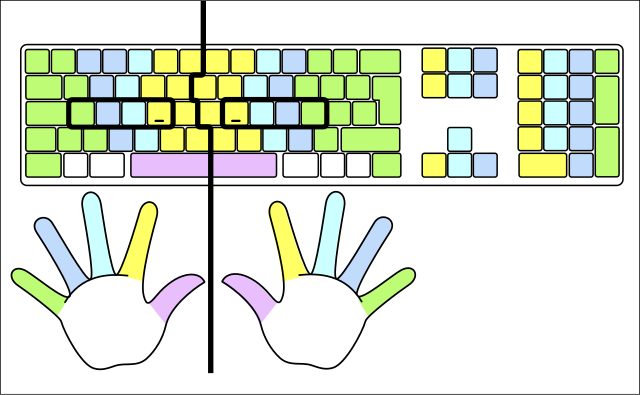
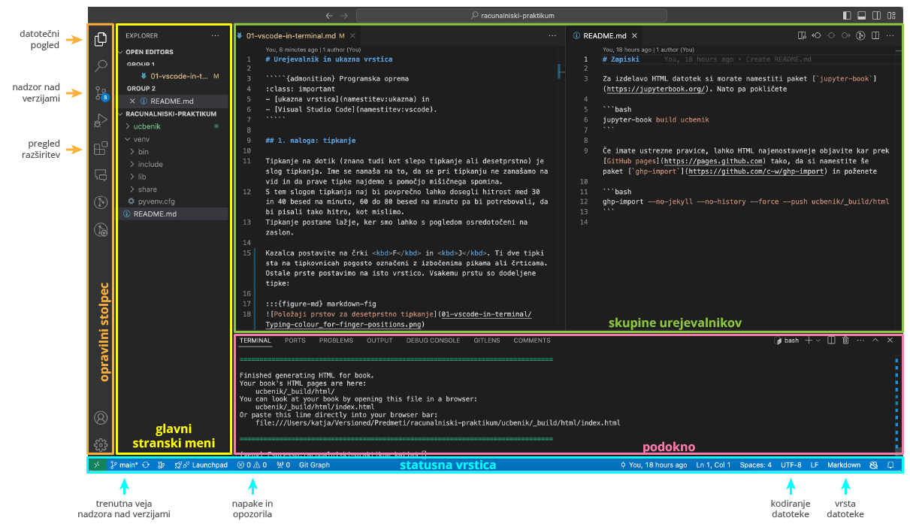

# Urejevalnik in ukazna vrstica

`````{admonition} Programska oprema
:class: important
- [ukazna vrstica](namestitev:ukazna) in 
- [Visual Studio Code](namestitev:vscode).
`````

## 1. naloga: tipkanje

Tipkanje na dotik (znano tudi kot slepo tipkanje ali desetprstno) je slog tipkanja. Ime se nanaša na to, da se pri tipkanju ne zanašamo na vid in da prave tipke najdemo s pomočjo mišičnega spomina.
S tem slogom tipkanja naj bi povprečno lahko dosegli hitrost med 30 in 40 besed na minuto, 60 do 80 besed na minuto pa bi potrebovali, da bi pisali tako hitro, kot mislimo.
Tipkanje postane lažje, ker smo lahko s pogledom osredotočeni na zaslon.

Kazalca postavite na črki <kbd>F</kbd> in <kbd>J</kbd>. Ti dve tipki sta na tipkovnicah pogosto označeni z izbočenima pikama ali črticama. Ostale prste postavimo na isto vrstico. Vsakemu prstu so dodeljene tipke:

:::{figure-md} markdown-fig


&nbsp; Položaji prstov za desetprstno tipkanje\
<span class="avtor">
   [Cy21](https://commons.wikimedia.org/wiki/User:Cy21),
   [CC BY-SA 3.0](https://creativecommons.org/licenses/by-sa/3.0),
   via ([Wikimedia Commons](https://commons.wikimedia.org/wiki/File:Typing-colour_for-finger-positions.svg.png))
</span>
:::

1. Preizkusite se na spletni strani [TypingTest.com](http://www.typingtest.com) (Izberite "1 minute" in "Medium").
2. Zapomnite si svoj rezultat (WPM – words per minute), saj ga boste vpisali v anketo, ki jo boste reševali za domačo nalogo.
   Rezultati bodo objavljeni anonimno, vi pa boste videli, kam se uvrščate.
3. Odločite se za postavitev tipkovnice (slovensko, angleško, Dvořak, ...) in približno 15 minut vadite tipkanje. Izberite vaje tako, da bo tipkovnica v lekcijah čim bolj podobna izbrani.
   - Na strani [Touch Typing Study](https://www.typingstudy.com/sl-slovenian-1/lesson/1/part/1) so lekcije nekoliko manj barvite, imate pa veliko izbiro postavitev tipkovnic, vključno s slovensko.
   - Če uporabljate angleško tipkovnico, lahko začnete s [prvo lekcijo na TypingTest.com](https://www.typingtest.com/trainer/applet.html?course_url=course_descriptions/fl5_us_sr_touchtyping.xml&lesson_id=A001) ali z lekcijami na [Typing.com](https://www.typing.com/student/lessons).
   - Na spletnih straneh [Typing Tutor](https://www.typingtutor-online.com), [Type Fu](https://type-fu.com) in [Typing Club](https://www.edclub.com/sportal/program-3.game) najdete vaje za manjši izbor postavitev tipkovnic v več jezikih.
   - Vaje tipkanja, ki so neodvisne od postavitve tipkovnice, najdete na [Keybr.com](https://www.keybr.com). 
   Na tej spletni strani vam ne pomagajo s sliko tipkovnice.

Petnajst minut vaje je seveda premalo, da bi se naučili desetprstnega tipkanja.
Če se želite naučiti, bo najlažje, če si vzamete vsak dan četrt ure za vedno težje vaje.
Po kakih 10 urah vaje bi vaši prsti že morali biti dovolj seznanjeni s tipkami, 
da boste lahko počasi tipkali desetprstno.
Ob rednih vajah boste tekoče tipkali do konca semestra.

`````{admonition} Nasvet za operacijski sistem MacOS
:class: tip
Za tipkanje redkejših znakov si pomagajte s programom [Keyboard Viewer](https://support.apple.com/en-gb/guide/mac-help/mchlp1015/mac),
ki je že nameščen na vašem sistemu.
`````

## 2. naloga: spoznajte VSCode

Tekom študija boste pisali matematična besedila in programirali.
Zato je pomembno, da se naučite kompetentno uporabljati profesionalni urejevalnik besedila. 
Priporočamo [Visual Studio Code](https://code.visualstudio.com/) (na kratko "VSCode"), 
odprto-kodni urejevalnik z dobro podporo za programiranje in pisanje besedil v LaTeX-u.
Navodila za vaje bodo predpostavljala, da uporabljate VSCode.
Seveda pa lahko uporabljate kak drug urejevalnik, pod pogojem, da ga res dobro poznate!

Urejevalniki, kot je VSCode, so namenjeni predvsem razvijalcem programske opreme in omogočajo urejanje izvorne kode programov.
V primerjavi z urejevalniki besedila, kot je Microsoft Word, v VSCode ne boste oblikovali naslovov ali s krepko pisavo poudarjali besed.
Kmalu boste opazili, da urejevalnik sam od sebe spreminja izgled določenih delov besedila. 
Temu rečemo poudarjanje sintakse in služi temu, da hitreje razberemo pomen izvorne kode (ali pa najdemo napake v njej).

1. Preletite stran "Get started" v [dokumentaciji za VSCode](https://code.visualstudio.com/docs).
2. Poženite VSCode in vsaj 3 minute pregledujte [dokumentacijo](https://code.visualstudio.com/docs).
3. Preletite razdelek o [uporabniškem vmesniku](https://code.visualstudio.com/docs/getstarted/userinterface).
   Še posebej bodite pozorni na osnovno razporeditev in glavne dele vmesnika (poiščite jih na svojem računalniku): 
    - opravilni stolpec (angl. _Activity Bar_), v katerem preklapljate različnimi pogledi stranskega menija, 
      kot so datoteke, nadzor nad verzijami in razširitve;
    - glavni stranski meni (angl. _Primary Side Bar_): oglejte si ga za datoteke, razširitve in Git,
    - skupine urejevalnikov (angl. _Editor Groups_),
    - podokno (angl. _Panel_), ki vsebuje npr. ukazno vrstico in sporočila o napakah,
    - statusna vrstica (angl. _Status Bar_) z uporabnimi informacijami, ki jih bomo spoznali kasneje.
4. Preletite [poglavje o osnovnem urejanju kode](https://code.visualstudio.com/docs/editor/codebasics).
5. V dokumentaciji poiščite, kako spremenite temo (izgled) urejevalnika in jo spremenite na tako, ki vam je všeč. 
6. Preletite [bližnjice na tipkovnici za svoj operacijski sistem](https://code.visualstudio.com/docs/getstarted/keybindings#_keyboard-shortcuts-reference).


:::{figure-md} markdown-fig


&nbsp; Uporabniški vmesnik urejevalnika VSCode
:::

## 3. naloga: življenje brez miške

Hitri programerji ne uporabljajo miške, ker jih le-ta upočasni. Pomembno je, da se naučite
uporabljati bližnjice v vseh programih, ki jih uporabljate pogosto. 
Veliko bližnjic se da uporabiti z eno roko. Npr. desničarji lahko z levo roko uporabite bližnjico <kbd>Alt</kbd>+<kbd>Tab</kbd> (<kbd>Cmd</kbd>+<kbd>Tab</kbd> na MacOS) za preklapljanje med okni, medtem ko imate desno roko na miški.

To vajo rešujte skupaj z asistentko/om ali demonstratorko/jem, ki pa vam ne sme pomagati pri iskanju bližnjic (lahko si pomagate med sabo).
Najprej preberite spodnja pravila in se pripravite na izvajanje naloge. 
Vnaprej poiščite potrebno dokumentacijo (na primer, kako se v VSCode besedilo z bližnjico spremeni v same velike
črke?), da ne boste brskali kasneje.

S tipkovnico in čim manjšo uporabo miške naredite naslednja opravila:

 1. Poženite urejevalnik VSCode.
 2. V urejevalniku v domačem imeniku (na Windows `C:\Users\⟨uporabnisko-ime⟩`, na MacOS pa `/Users/⟨domace-uporabnisko-ime⟩`)
    ustvarite in odprite imenik za Računalniški praktikum (npr. `C:\Users\⟨uporabnisko-ime⟩\RP`).
 3. Ustvarite novo datoteko in jo takoj shranite v domači imenik. Poimenujte jo `besedilo.txt`.
 4. Poskrbite, da bo kodiranje nastavljeno na `UTF-8` (glejte spodaj desno v statusno vrstico v VSCode).
 5. Napišite vsaj tri vrstice poljubnega besedila.
 6. Pomaknite se na začetek vrste s čim manj pritiskov tipk.
 7. Pomaknite se naprej za eno besedo s čim manj pritiskov tipk.
 8. Zbrišite vrsto s čim manj pritiskov tipk.
 9. Shranite datoteko `besedilo.txt`.
10. Zaprite datoteko `besedilo.txt`.
11. Ponovno odprite datoteko `besedilo.txt`.
12. Ustvarite novo datoteko, shranite jo kot `besedilo2.txt` in vanjo prekopirajte vaše prvotno besedilo.
13. Pretvorite besedilo v `besedilo2.txt` tako, da bo zapisano iz SAMIH VELIKIH ČRK.
14. Shranite datoteko `besedilo2.txt`.

Morda vam bo v pomoč tudi [plonkec za uporabo tipkovnice](plonkec:tipkovnica).

## 4. naloga: škrati

V tej nalogi boste srečali ukazno vrstico, glavni namen vaje pa je, 
da začnete razvijati boljši občutek za to, kako računalnik deluje v ozadju.
Ukazna vrstica je uporabniški vmesnik, ki so ga največ uporabljali v bakreni dobi računalništva,
naprednejšim uporabnikom računalnika pa še vedno pride prav.
Če še niste med njimi, pa boste do konca študija prav gotovo med njimi tudi vi.

Za hitrejše preklapljanje med oknom z navodili in oknom z ukazno vrstico priporočamo 
bližnjico <kbd>Alt</kbd>+<kbd>Tab</kbd> (🍎 <kbd>Cmd</kbd>+<kbd>Tab</kbd>). 
Tudi sicer bo tipka <kbd>Tab</kbd> pri tej vaji hudo uporabna. 
Pomaga vam dopolniti ukaz: to še posebej pride prav pri dolgih imenih, ki vsebujejo preslednico.
Taka imena je treba postaviti med znaka `"`, na primer: `"To je dolgo ime z veliko presledki"`.

1. Na računalnik naložite arhiv za svoj operacijski sistem: [`skrati-windows.zip`](01-vscode-in-terminal/skrati-windows.zip)
   ali [`skrati-macosx.zip`](01-vscode-in-terminal/skrati-macosx.zip) (ta bo pravi tudi za Linux) in ga [odpakirajte](faq:zip).
2. Na računalnik shranite tudi PDF datoteko [`skrati.pdf`](01-vscode-in-terminal/skrati.pdf) in jo odprite.
3. [Odprite imenik `rudnik` v ukazni vrstici](faq:ukazna-imenik).
4. V ukazno vrstico kopirajte spodnji ukaz in pritisnite vnašalko <kbd>↵</kbd> (angl. _enter_ ali _return_). 
   - `cd "Vhodna dvorana/Dolgočasna pravokotna dvorana/Radegastov kot/Zahodno križišče"`

`````{admonition} Nasvet za operacijski sistem Windows
:class: tip
Preverite, ali za kopiranje in lepljenje v programu Git Bash delujeta običajni bližnjici.
Če ne, bosta morda delovali <kbd>Ctrl</kbd>+<kbd>Ins</kbd> in <kbd>Shift</kbd>+<kbd>Ins</kbd>.
`````

<!-- Dodatno za Windows Powershell (staro)
$OutputEncoding = [System.Console]::OutputEncoding =[System.Console]::InputEncoding = [System.Text.Encoding]::UTF8 
$PSDefaultParameterValues['*:Encoding'] = 'utf8'
? https://stackoverflow.com/questions/10651975/unicode-utf-8-with-git-bash
-->

Naloga je interaktivna zgodba, v kateri boste uporabljali uroke, ki pa so v resnici programi.
Zgoraj ste že videli programa `cd` (kratko za angl. *change directory*) in `pwd` (kratko za angl. *print working directory*).
Program `cd` uporabimo s parametrom (nizom znakov), ki predstavlja pot do imenika, v katerega se hočemo prestaviti,
program `pwd` pa ne potrebuje parametrov.

V zgodbi so navodila in namigi za posamezni odsek podani ležeče.
Z branjem nadaljujte šele, ko opravite vse, kar piše.
Sedaj lahko sledite navodilom v PDF datoteki.
Veliko zabave in pazite na glavo, stropi so nizki!

## Domača naloga

1. Rešite [anketo o predznanju računalništva](https://ucilnica.fmf.uni-lj.si/mod/feedback/view.php?id=32277) na učilnici.
2. Izberite tri izmed bližnjic na tipkovnici, ki ste jih srečali na vajah, pa jih še ne uporabljate.
   Zapomnite si jih. Lahko si začnete pripravljati tudi svoj plonkec za vaje pri Računalniškem praktikumu.
3. Naredite si uporabniški račun (če ga še nimate) na platformi [GitHub](https://github.com/signup).
   Predlagamo, da si izberete tako uporabniško ime, da ga boste lahko uporabili še pri kakem predmetu tekom študija.
   (Tudi profesorji in asistenti večinoma nimajo uporabniških imen, kot je `FunnyBunny42`.)
4. Prijavite se v GitHub in ustvarite svoj prvi repozitorij po navodilih, ki jih najdete na strani 
   [Quickstart for repositories](https://docs.github.com/en/repositories/creating-and-managing-repositories/quickstart-for-repositories),
   pri čemer upoštevajte še naslednje:
    - predlagamo, da repozitorij poimenujete `racunalniski-praktikum`,
    - repozitorij naj bo _Public_ (zato, da bomo lahko pregledali vaše oddane domače naloge),
    - v razdelku _Commit your first change_, točka 3, popravite prvo vrstico tako, da bo pisalo `# Računalniški praktikum`,
    - v vrstico spodaj napišite bližnjice iz prve točke te naloge (skupaj z opisom),
    - v istem razdelku pod točko 7 napišite na primer `dopolni README` (in se ne ukvarjajte z dodajanjem avtorjev),
    - še vedno v razdelku _Commit your first change_, točka 8, izberite _Commit directly to the main branch_,
    - navodilom sledite samo do razdelka _Next steps_.
5. Na [učilnici](https://ucilnica.fmf.uni-lj.si/mod/assign/view.php?id=70431) oddajte naslov repozitorija: `https://github.com/⟨uporabnisko-ime⟩/⟨ime repozitorija⟩`.
   Pred oddajo preverite, da je naslov pravi (sicer ne boste dobili točk).
6. Preberite si stran o [računalniških sistemih, storitvah in opremi za študente](https://ucilnica.fmf.uni-lj.si/mod/page/view.php?id=51619).
7. Pridružite se Discord strežniku, ki ga uporabljamo pri nekaterih predmetih. 
   Uporabite povezavo [https://discord.gg/bgC7gjQmTq](https://discord.gg/bgC7gjQmTq) in si v kanalu `#dobrodošli` izberite predmete, ki jih poslušate.

Točka za domačo nalogo se vam bo upoštevala, če boste oddali naslov javnega repozitorija
z datoteko `README.md`, v kateri v prvi vrstici piše `# Računalniški praktikum`.
Prva sprememba (oz. _commit_) v tem repozitoriju mora biti med 
torkom, 1. oktobra 2024, ob 00:00 in
torkom, 22. oktobra 2024, ob 23:55.
Za vse nadaljnje domače naloge bomo predpostavljali, da uporabljate ta repozitorij.

Toplo priporočamo še naslednje naloge:

- Poženite VSCode in vsaj 3 minute pregledujte [dokumentacijo](https://code.visualstudio.com/docs).
- Pred spanjem si oglejte [Introductory Videos](https://code.visualstudio.com/docs/getstarted/introvideos#VSCode). 
  Ni treba, da veste kaj so programski jeziki, poglejte si, kako se uporablja urejevalnik.
- Ob jutranji kavici prebirajte [User guide](https://code.visualstudio.com/docs/editor/codebasics).
