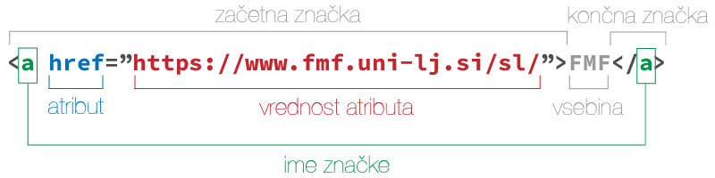
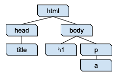

# Označevalni jezik HTML

HTML (angl. _**H**yper**T**ext **M**arkup **L**anguage** _, jezik za označevanje hiperteksta oz. nadbesedila), 
je osnovni jezik za ustvarjanje spletnih strani in spletnih aplikacij.
Spletnim brskalnikom, kot so Google Chrome, Firefox, Edge ali Safari, pove, kako naj prikažejo vsebino spletne strani.
To naredi z označevanjem gradnikov, kot so naslovi, odstavki, slike, povezave, tabele in obrazci.
Vsaka oznaka (značka, angl. _tag_) označuje določen del vsebine.
Ko brskalnik prejme HTML dokument, prebere oznake in prikaže vsebino na zaslonu. 
V ozadju te oznake pomagajo brskalniku razumeti, kaj naj prikaže in kako naj to prikaže.

`````{admonition} Programska oprema
:class: important
- [Visual Studio Code](namestitev:vscode),
- razširitev [HTMLHint](https://marketplace.visualstudio.com/items?itemName=mkaufman.HTMLHint) in 
- razširitev [HTML Preview](https://marketplace.visualstudio.com/items?itemName=tht13.html-preview-vscode).
`````

`````{admonition} Shranite vaje na strežnik
:class: important
Na koncu 2.-4. naloge zabeležite spremembe.
Če naloge slučajno ne končate na vajah, vseeno zabeležite spremembe - 
v sporočilo napišite na primer `V delu: ...` s kratkim opisom narejenega.
[Preden odidete iz predavalnice](https://www.reddit.com/r/ProgrammerHumor/comments/3nc531/in_case_of_fire/), 
pošljite spremembe na strežnik s paleto ukazov:
<kbd>Ctrl</kbd>+<kbd>Shift</kbd>+<kbd>P</kbd> (🍎 <kbd>Cmd</kbd>+<kbd>Shift</kbd>+<kbd>P</kbd>) >
**Git: Push**.
`````

## Struktura dokumenta

HTML dokument je sestavljen iz vsebine in značk. _Značke_ imajo lahko lastnosti oz. atribute. 
Prepoznamo jih po oklepajih `<` in `>`, npr. `<h1>` ali ``.
Značke bomo vedno najprej odprli (`<znacka>`) in nato zaprli (`</znacka>`).

:::{figure-md} markdown-fig


&nbsp; Sestavni deli HTML značke
:::

Pri nekaterih značkah bomo uporabili tudi atribute.
Primer značke z atributom je značka za povezavo `<a>` (angl. _anchor_).
V atribut `href` napišemo spletni naslov, na katerega kaže povezava, vsebina značke pa je besedilo povezave,
ki se bo prikazalo v brskalniku.

Značke lahko gnezdimo eno v drugo: `<a href="http://fmf.uni-lj.si/"><em>FMF</em></a>`.
Značke se ne smejo prekrivati.
Če pogledamo dve znački, je bodisi ena v vsebini druge, bodisi se sploh ne prekrivata.
Narobe je npr. `<a href="http://fmf.uni-lj.si/"><em>FMF</a></em>`.
Predstavljate si lahko, da so značke škatle, ki držijo vsebino.

Dodatni viri:

* [HTML elements reference](https://developer.mozilla.org/en-US/docs/Web/HTML/Element)

### Enostaven primer HTML dokumenta

```html
<!DOCTYPE html>
<html>
  <head>
    <title>Enostavna spletna stran</title>
  </head>
  <body>
    <!-- V naslednjih dveh vrsticah je vsebina (telo) spletne strani -->
    <h1>Jaz sem naslov!</h1>
    <p>V odstavkih imamo lahko tudi <a href="https://www.fmf.uni-lj.si/">povezave</a></p>
  </body>
</html>
```

Včasih si je dobro predstavljati tak dokument kot hierarhijo značk:

:::{figure-md} markdown-fig


&nbsp; Hierarhija značk za zgornji primer dokumenta
:::

## 1. naloga: orodja za razvijalce

Spletni brskalniki imajo ponavadi vgrajena orodja, ki omogočajo razvijalcem in oblikovalcem pregledovanje, 
urejanje in razhroščevanje spletnih strani in aplikacij neposredno znotraj brskalnika. 
Ta orodja vključujejo funkcionalnosti za pregledovanje in urejanje HTML in CSS kode, 
izvajanje in razhroščevanje JavaScript kode, spremljanje omrežnih zahtevkov, analiziranje zmogljivosti strani, 
pregledovanje uporabe pomnilnika, itd.

Ko v brskalniku obiščete spletno stran, se na vaš računalnik naloži kopica datotek, ki jih brskalnik uporabi,
da vam prikaže vsebino spletne strani.
Sledite naslednjim korakom, da boste dobili boljšo predstavo o tem, kaj pomeni brskanje po spletu.

* Odprite okno brskalnika.
* V razdelku za brskalnik, ki ste ga odprli, sledite navodilom za orodja za razvijalce (več o tem spodaj).
* Poiščite in odprite zavihek _Network_.
* V naslovni vrstici brskalnika vpišite naslov `https://www.fmf.uni-lj.si/` in stisnite vnašalko <kbd>↵</kbd>.
* Poglejte, kaj vse se je preneslo na računalnik, da se je prikazala prva stran FMF.
* Preklopite na zavihek z izvorno kodo (spodaj za posamezni brskalnik) 
  in si oglejte, kako izgleda izvorna koda strani.

Orodja za razvijalce:

* ***Chrome***: odprite stranski meni in izberite **More tools** > **Developer Tools**,
* ***Firefox***: odprite stranski meni in izberite **More tools** > **Web Developer Tools**,
* ***Safari***: odprite meni **Develop** in izberite **Show Web Inspector**. Če menija **Develop** ne vidite, sledite [navodilom](https://support.apple.com/en-om/guide/safari/sfri20948/mac).
* Alternativno lahko Orodja za razvijalce neposredno odprete s pritiskom na tipko <kbd>F12</kbd> ali pa z uporabo bližnjice <kbd>Ctrl</kbd>+<kbd>Shift</kbd>+<kbd>I</kbd> (🍎 <kbd>Cmd</kbd>+<kbd>Option</kbd>+<kbd>I</kbd>).

Zavihek za izvorno kodo strani:

* ***Chrome in Safari***: izvorna koda je v zavihku _Elements_,
* ***Firefox***: izvorna koda je v zavihku _Inspector_.
 
## 2. naloga: delo s HTML dokumentom, glava dokumenta

V tej nalogi boste spoznali osnovno ogrodje HTML dokumenta in kako za urejanje lahko uporabimo VSCode.

HTML značke lahko pišemo bodisi z velikimi ali malimi črkami.
Običajno pišemo vse z malo, razen značke `DOCTYPE`.
Tudi mi se bomo držali tega dogovora.

1. V VSCode odprite imenik s svojim repozitorijem.
   V njem naredite nov imenik `03-html`, v njem pa novo datoteko `stran.html` in jo odprite.
   V urejevalniku odprite okno _Problems_.
   Spodaj levo lahko kliknete na ikoni s križcem v krogu in klicajem v trikotniku, 
   ali pa ga poiščete v meniju **View**.
   Če postavite kurzor v datoteko `stran.html`, se bo v zavihku PROBLEMS pojavilo opozorilo: 
   `Doctype must be declared first. (doctype-first) [1, 1]`. 
   Enici v oglatih oklepajih nam povesta, da je težava v prvi vrstici (in prvem stolpcu).

2. Težavo odpravimo tako, da napišemo značko `DOCTYPE`.
   Ta brskalniku pove, za kakšno vrsto dokumenta gre.
   Napišite `<` in počakajte, da se vam v priročnem meniju pokaže možnost `DOCTYPE`.
   Morda boste morali dopisati še klicaj: `<!`. Stisnite vnašalko <kbd>↵</kbd>. 
   Zdaj bi moralo v prvi vrstici pisati `<!DOCTYPE html>`.
   Če ne, lahko značko tudi prekopirate od tu.
   Značka `DOCTYPE` ne potrebuje zaključne značke.

3. V novo vrstico (zaradi preglednosti) za značko `DOCTYPE` napišite značko `html`: 
   Kot prej, lahko napišete `<` in iz priročnega menija izberete `html`, lahko pa samo napišete `<html`.
   Zaključno značko vam bo urejevalnik dopisal sam,
   ko boste značko napisali do konca z znakom `>`: `<html>`.
   V drugi vrstici bi zdaj moralo pisati `<html></html>`, kurzor pa bi moral stati med `><`.
   Stisnite vnašalko <kbd>↵</kbd> za novo vrstico.

4. V značko `html` dodajte eno za drugo še znački `head` in `body`.
   Zamaknjeni naj bosta za dva presledka (tudi to delamo zaradi preglednosti).
   Na splošno naj bodo gnezdene značke vedno zamaknjene za dva presledka glede na višji nivo.
   V zavihku _Problems_ bi se moralo pojaviti novo opozorilo. 
   Odpravite ga, pa tudi tisto opozorilo, ki se pojavi takoj za tem.

5. Na spletni strani za [HTML standard](https://validator.w3.org/nu/#textarea) lahko preverite, 
   kako se vaša izvorna koda obnese pri bolj strogem preverjanju.
   Koda za slovenski jezik je `sl`, za angleški pa `en`.
   Značka `html` z atributom za jezik pa izgleda takole: `<html lang="en">`.

6. Značka `title` določi naslov dokumenta, kot se prikaže v naslovni vrstici brskalnika.
   Naslov dokumenta naj bo "ISO 3103".

7. V glavo dokumenta dodajte spodnjo značko, da določite kodiranje dokumenta
   `<meta charset="UTF-8">`. Te značke ni treba zaključiti.
   Če je ne boste dodali, se vam bo znak `±` prikazoval takole nekako: `±`.

8. Počistite vse napake in opozorila, preden nadaljujete z naslednjo nalogo.
   Če ne veste kako, se obrnite na asistentko ali asistenta.

9. Zabeležite spremembo:
   1. V opravilnem stolpcu poiščite ikono za Git (če se zapeljete nanjo z miško, bo pisalo _Source Control_) 
      in jo kliknite, da dobite stranski meni za nadzor nad verzijami.
   2. Pod napisom _Changes_ bi morala biti našteta datoteka `stran.html`.
      Če se nad vrstico z imenom datoteke zapeljete z miško, boste na desni strani videli ikone za opravila.
      Kliknite na <kbd>+</kbd> (_Stage Changes_, ki izvede ukaz [`add`](git:osnovni-ukazi)).
   3. Datoteka se bi morala premakniti pod napis _Staged Changes_. 
      Kadar zabeležite spremembo (naredite _commit_), 
      se v repozitorij shranijo natanko spremembe, ki so naštete pod tem napisom.
      Da naredite commit, napišite sporočilo v vnosno polje nad gumbom <kbd>Commit</kbd>,
      v katerem v nekaj besedah opišete, kaj ste naredili, npr. `Pripravi strukturo HTML dokumenta`.

Za reševanje skupaj: na tablo narišite drevesno strukturo značk.

## 3. naloga: predogled v brskalniku in vsebina

`````{admonition} Del domače naloge
:class: attention
Datoteko, ki jo boste pripravili, boste potrebovali za domačo nalogo.
`````

Pri tej nalogi vam bo v pomoč paleta ukazov (Command Palette) v urejevalniku, 
do katere dostopate preko bližnjice <kbd>Ctrl</kbd>+<kbd>Shift</kbd>+<kbd>P</kbd> (🍎 <kbd>Cmd</kbd>+<kbd>Shift</kbd>+<kbd>P</kbd>).
V paleti ukazov začnete tipkati ime ukaza, z vnašalko <kbd>↵</kbd> pa izberete ukaz, 
ki je prvi na seznamu najdenih ukazov.

Ukaz _Wrap with Abbreviation_ označeno besedilo obda z značko, ki jo napišete.
Če besedilo ni označeno, bo urejevalnik značko postavil okrog vrstice, v kateri je kurzor.
Ko ste v paleti ukazov, lahko poiščete zobato kolo na desni strani vrstice z ukazom.
To je ikona za nastavitve. Če jo kliknete, pridete na stran z nastavitvami,
kjer si lahko za ta ukaz nastavite svojo neposredno bližnjico.
Primer uporabe ukaza je opisan v točki 3.

VSCode vam dovoli uporabljati [več kurzorjev hkrati](bliznjice:kurzorji), kar se da lepo uporabiti z
ukazom _Wrap with Abbreviation_.
Ko ste pripravili kurzorje, uporabite bližnjico za paleto dokazov in nadaljujete enako,
kot pri enem samem kurzorju.

 1. Datoteko odprite v brskalniku, da vidite, kako izgleda.

 2. V urejevalniku v značko `body` prilepite vsebino datoteke [`vsebina.txt`](03-html/vsebina.txt).
    Odstavki so ločeni s praznimi vrsticami.
    Datoteko shranite. Z bližnjico <kbd>Alt</kbd>+<kbd>Tab</kbd> (🍎 <kbd>Cmd</kbd>+<kbd>Tab</kbd>) skočite nazaj v brskalnik,
    kjer pritisnite <kbd>Ctrl</kbd>+<kbd>R</kbd> (🍎 <kbd>Cmd</kbd>+<kbd>R</kbd>), da osvežite stran.

 3. Na začetku besedila, ki ste ga ravnokar prilepili, označite naslov "ISO 3103".
    Stisnite tipke <kbd>Ctrl</kbd>/<kbd>Cmd</kbd>+<kbd>Shift</kbd>+<kbd>P</kbd>, da pridete v pogovorno okno palete ukazov.
    Začnite tipkati ime ukaza _Wrap with Abbreviation_ `wrap...`,
    ter ga izberite z vnašalko <kbd>↵</kbd>, ko se pojavi na vrhu seznama.
    Naslednjič, ko boste hoteli uporabiti ta ukaz, se bo na vrhu seznama pojavil že
    po manjšem številu natipkanih znakov.
    Pojavi se še eno pogovorno okno, v katerega napišite ime značke za naslov (`h1`),
    ter stisnite vnašalko <kbd>↵</kbd>.
    V vrstici, kjer je bil prej samo označeni naslov, bi moralo zdaj pisati
    `<h1>ISO 3103</h1>`.

 4. Z ustreznimi značkami označite še podnaslove (`h2`) 
    "Details", "Pot and bowl", "Criticism" in "Competing standards".
    in podpodnaslov (`h3`) "Contents" na začetku besedila.
    _Namig:_ <kbd>Alt</kbd>/<kbd>Option</kbd> + desni klik

 5. Pod podpodnaslovom "Contents" so našteta podpoglavja. Oblikovali bomo preprost seznam vsebine.
    Najprej bomo pomočjo večih kurzorjev vsako vrstico s podpoglavjem obdali z značko.
    Postavite kurzor na začetek vsake vrstice (<kbd>Ctrl</kbd>+<kbd>Alt</kbd>+<kbd>↑↓</kbd> oz. <kbd>Cmd</kbd>+<kbd>Option</kbd>+<kbd>↑↓</kbd>),
    stisnite in držite tipko <kbd>Shift</kbd> (za označevanje), nato pa še <kbd>End</kbd> oz. <kbd>Cmd</kbd>+<kbd>→</kbd> (za skok na konec vrstice).
    Zdaj bi morali imeti označene vse vrstice kazala vsebine, vsako vrstico s svojim kurzorjem.
    Na vseh naenkrat zdaj lahko uporabite ukaz _Wrap with Abbreviation_ z značko `li` (angl. _list item_).
    Končno izberite vse vrstice (tokrat z enim kurzorjem) in jih obdajte z značko `ol` (angl. _ordered list_).
    _Wrap with Abbreviation_ naredi toliko značk, kot imate kurzorjev, za vsakega eno.

 6. Preverite, če ste osvojili tehniko iz prejšnje točke.
    Pod podnaslovom "Details" naj bodo vsi odstavki razen prvega
    elementi neurejenega seznama (angl. _unordered list_, značka `ul`).
    Odstavki so ločeni s praznimi vrsticami, v katerih nočemo narediti elementov seznama, 
    zato kurzorje postavite s klikanjem.

 7. Citat (odstavek pod besedilom "The abstract states the following:") 
    označimo z značko `blockquote`.

 8. Vsi ostali odstavki so običajni. Take označimo z značko `p`.

 9. V prvem odstavku naj bo "ISO 3103" povezava na Wikipedijo.
    To naredite z značko `a` in atributom `href`, katerega vrednost naj bo naslov strani.

10. V 2. in 8. elementu v razdelku "Details" sta tabeli s po tremi stolpci, tremi vrsticami.
    Tabelo v HTML naredimo z značko `table`, v kateri so značke `tr` za vrstice tabele.
    V vsaki vrstici naštejemo celice z značkami `td`, celice za glavo tabele pa s `th`.
    Celice za glavo uporabite v prvi vrstici in v prvem stolpcu.

11. Prenesite in vstavite [sliko](03-html/tea-bowl.jpg) z značko `img`, ki je ni treba zaključiti.
    Podate ji atribut `src`, v katerem podate pot do slike in atribut `alt`, v katerem podate opis.
    Ta opis se uporabi v primerih, ko se slika ne prikaže, in za dostopnost
    (npr. za avtomatsko branje vsebine).
    Preverite v brskalniku, če se slika prikaže.
    Verjetno bo prevelika, tako da jo za zdaj zakomentirajte:
    v paleti ukazov poiščete `comment` in izberete _Add Line Comment_.

12. Počistite vse napake in opozorila, preden nadaljujete z naslednjo nalogo.

13. Zabeležite spremembo: dodajte datoteki `stran.html` in `tea-bowl.jpg`
    ter napišite uporabno sporočilo, npr. `Dodaj vsebino HTML dokumenta`.
    

## 4. naloga: matematika in sklicevanje

1. V drugem odstavku poudarite začetek "ISO 3103" z značko `strong`.
   Besedilo "brewing tea" označite z značko `em`.
   V starih časih se je pogosto uporabljalo znački `b` (angl. _bold_)
   in `i` (angl. _italic_).
   Zdaj se v dobri praksi ločuje pomen (predstavljen s HTML značkami)
   in oblikovanje (CSS, ki ga bomo srečali na naslednjih vajah).

2. Dodali bomo [MathJax](https://www.mathjax.org/) za lepe matematične formule z LaTeX-om.
   Sledite navodilom [Getting Started](https://www.mathjax.org/#gettingstarted) (za verzijo MathJax 3).
   Košček kode, ki bo vaši strani dodal skripto MathJax, dodate v glavo dokumenta.
   Spletni strani dodajte formulo, npr. `\[x = \frac{-b \pm \sqrt{b^2-4ac}}{2a}\]`.
   Za zdaj še ni treba, da razumete, kako formule delujejo. 

3. V zavihku _Network_ poglejte, kaj se zgodi, ko osvežite stran.

4. Formula, ki ste jo ravnokar napisali, je zapisana v posebni sintaksi
   oz. kontroliranem jeziku, ki omogoča računalniku, da vsaj do neke mere razume, kaj želimo narediti.
   Poskusite razbrati, kako deluje sintaksa matematičnega izraza zgoraj.
   Najdete ukaze in parametre, ter kako so označeni?

5. Pomagajte si s formulo zgoraj, da napišete enačbo $e^{i\pi} + 1 = 0$ 
   (poskusite uganiti, kako bi napisali črko $\pi$).

6. Sklicevanje znotraj dokumenta naredimo z značkami `a`, kjer želimo, da je povezava
   in atributi `id`, kamor želimo, da povezava kaže.
   Če naslovu "Criticism" dodamo atribut `id` z vrednostjo `criticism` takole: 
   `<h2 id="criticism">Criticism</h2>`, nas bo povezava `<a href="#criticism">Criticism</a>`
   pod podnaslovom "Contents" peljala do naslova.
   Popravite elemente seznama pod "Contents" tako, da bodo delujoče povezave na ustrezne
   dele strani.

7. Zabeležite spremembo: dodajte datoteki `stran.html`
   ter napišite uporabno sporočilo, npr. `Dodaj formule in sklicevanje`.

## Domača naloga

1. Če za študij uporabljate še kak drug računalnik, ga pripravite za delo z Git-om in VSCode.
2. Dokončajte vaje, če jih še niste.
3. Nekaj časa (recimo 20 minut) igrajte [Bashcrawl](https://gitlab.com/slackermedia/bashcrawl)
    1. Odprite ukazno vrstico in se premaknite v imenik, kjer imate spravljene repozitorije.
    2. Klonirajte repozitorij: `git clone https://gitlab.com/slackermedia/bashcrawl.git bashcrawl`.
    3. Premaknite se na začetek igre: `cd bashcrawl/entrance`.
    4. Preberite zvitek z navodili: `cat scroll`.
4. Enkrat pred naslednjimi vajami si preberite začetek [poglavja o CSS](04-css) (do 1. naloge).

Točka za domačo nalogo se vam bo upoštevala, 
če bo v vašem repozitoriju (na glavni oz. privzeti veji)
sprememba (oz. _commit_) datotek `stran.html` in `tea-bowl.jpg`.
Datoteka `stran.html` je lahko tudi prazna, čeprav to odsvetujemo.
Sprememba mora imeti čas med
ponedeljkom, 14. oktobra  2024, ob 00:00 in
ponedeljkom,  4. novembra 2024, ob 23:55.

Pregledali bomo nekaj oddanih nalog z vaj (datoteke `stran.html` v imeniku `03-html`).
Glavni namen tega je, da dobite povratne informacije, predvsem o najpogostejših napakah.
