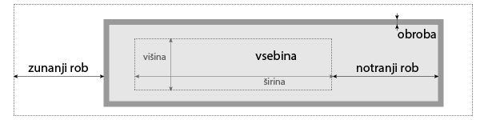

# Oblikovanje HTML dokumentov s CSS

CSS (angl. _**C**ascading **S**tyle **S**heets_) je jezik, s katerim lahko predpišemo izgled spletne strani. 
S HTML ustvarimo strukturo spletne strani: besedilo, naslove, gumbe, slike in tabele,
s CSS pa določimo barve, pisave, postavitev, velikosti in druge vizualne lastnosti elementov na strani.

Jezika HTML in CSS sta primer [ločevanja vsebine in predstavitve](https://en.wikipedia.org/wiki/Separation_of_content_and_presentation).
Po tem načelu se vizualni in oblikovni vidiki (predstavitev in slog) ločijo od osnovnega materiala in strukture (vsebine) dokumenta. 

Različni brskalniki imajo različne načine za prikazovanje nekaterih elementov spletnih strani.
Zato skoraj vse spletne strani najprej uporabijo CSS, ki poenoti prikazovanje elementov.
Take CSS datoteke skoraj nihče ne naredi od začetka, ampak se uporabi eno od že obstoječih, kar bomo naredili tudi mi.
V resnici se ponavadi uporabi kar enego od obstoječih ogrodij za izdelavo spletnih strani (npr. Bootstrap).

`````{admonition} Programska oprema
:class: important
- [Visual Studio Code](namestitev:vscode),
- razširitev [HTMLHint](https://marketplace.visualstudio.com/items?itemName=mkaufman.HTMLHint) in 
- razširitev [HTML Preview](https://marketplace.visualstudio.com/items?itemName=tht13.html-preview-vscode).
`````

`````{admonition} Shranite vaje na strežnik
:class: important
Na koncu vsake naloge zabeležite spremembe.
Če naloge slučajno ne končate na vajah, vseeno zabeležite spremembe - 
v sporočilo napišite na primer `V delu: ...` s kratkim opisom narejenega.
[Preden odidete iz predavalnice](https://www.reddit.com/r/ProgrammerHumor/comments/3nc531/in_case_of_fire/), 
pošljite spremembe na strežnik s paleto ukazov:
<kbd>Ctrl</kbd>+<kbd>Shift</kbd>+<kbd>P</kbd> (🍎 <kbd>Cmd</kbd>+<kbd>Shift</kbd>+<kbd>P</kbd>) >
**Git: Push**.
`````

## Osnovni pojmi in orodja

Glavni gradniki jezika CSS so deklaracije, ki so sestavljene iz lastnosti in vrednosti za to lastnost.
Sintaksa deklaracije zgleda takole: `⟨lastnost⟩: ⟨vrednost⟩;` 
(na podpičje na koncu deklaracije je lahko pozabiti, ampak se nikoli ne konča dobro).
Primeri:

- `font-size: 12px;`
- `color: #FFFF00;`

Deklaracije sestavimo v bloke (tako da jih obdamo z zavitimi oklepaji) in jim dodamo izbiralce,
ki določajo, na katerih elementih se bodo uporabile deklaracije:

```css
h1 {
  font-size: 12px;
  color: #FFFF00;
}
```

V zgornjem primeru določimo vsebini vseh značk velikost in barvo pisave.
Nekoliko poenostavljeno lahko rečemo, da je css datoteka sestavljena iz blokov deklaracij z izbiralci.

Prav vam bodo prišli spodnji enostavni izbiralci 
(zadnjo vrsto, [gnezdenje](https://developer.mozilla.org/en-US/docs/Web/CSS/Nesting_selector), smo izpustili).

- [Izbiralec za značke](https://developer.mozilla.org/en-US/docs/Web/CSS/Type_selectors) 
  `⟨znacka⟩` (angl. _type selector_) izbere vse značke `znacka` v dokumentu (kot zgoraj za značko `h1`).
- [Izbiralec za atribute](https://developer.mozilla.org/en-US/docs/Web/CSS/Attribute_selectors) (angl. _attribute selector_)
  ima več oblik, tu omenimo samo dve najenostavnejši:
    - `[⟨atribut⟩]` izbere vse značke v dokumentu, ki imajo atribut `atribut`,
    - `[⟨atribut⟩=⟨vrednost⟩]` izbere vse značke v dokumentu, ki imajo atribut `atribut`, z vrednostjo `vrednost`.
- [Izbiralec za razrede]() `.⟨razred⟩` (angl. _class selector_) izbere vse značke v dokumentu, ki imajo atribut `class` z vrednostjo `razred`.
- [Izbiralec po identifikatorju](https://developer.mozilla.org/en-US/docs/Web/CSS/ID_selectors) `#⟨id-elementa⟩` 
  (angl. _ID selector_) izbere natanko tisto značko v dokumentu, ki ima atribut `id` z vrednostjo `id-elementa`.
- [Univerzalni izbiralec](https://developer.mozilla.org/en-US/docs/Web/CSS/Universal_selectors) `*` (angl. _universal selector_), 
  ki izbere vse značke v dokumentu.

Enostavne izbiralce lahko združimo v [sestavljene izbiralce](https://developer.mozilla.org/en-US/docs/Web/CSS/CSS_selectors/Selector_structure#compound_selector), tako da jih staknemo brez presledkov;
pri tem moramo paziti na to, da najprej napišemo izbiralec za značke ali univerzalni izbiralec.
Primer: `p.poudarjeno` združi izbiralca `p` in `.poudarjeno`:
izbere vse značke `p` (za odstavke), ki imajo določen atribut `class` z vrednostjo `poudarjeno`.

Izbiralce se da sestavljati v kompleksne izbiralce s t.i. kombinatorji, vendar tu omenimo le dva enostavna primera; 
za kaj več si poglejte [dokumentacijo](https://developer.mozilla.org/en-US/docs/Web/CSS/CSS_selectors).

- Potomce izbiramo s kombinatorjem ` ` (presledek). 
  Na primer, izbiralec `li a` izbere vse povezave (`a`), ki so v elementih seznama (`li`).
- Z vejico `,` združimo več izbiralcev v enega: izbiralec `h1, h2` izbere vse značke `h1` in `h2`.

Včasih pridejo prav tudi t.i. psevdo-razredi, s katerimi izbiramo elemente, ki imajo posebno stanje.
Ponavadi jih uporabimo tako, da jih pritaknemo na koncu izbiralca.
Primer: elemente, nad katerimi je miška, izberemo s `:hover`.
Tako lahko npr. izberemo vse povezave, nad katerimi je miška (`a:hover`), da jim spremenimo barvo.

### Škatlasti model

Že prejšnji teden smo omenili, da si lahko HTML značke (elemente spletne strani) predstavljate kot škatle,
ki držijo vsebino in druge škatle.
Ta analogija pride prav tudi pri oblikovanju elementov.
Vsak element strani, recimo odstavek ali slika, je obravnavan kot škatla ali okvir, ki je sestavljena iz štirih glavnih delov:

:::{figure-md} markdown-fig


&nbsp; Škatlasti model
:::

Dodatni viri:

* [The standard CSS box model](https://developer.mozilla.org/en-US/docs/Learn/CSS/Building_blocks/The_box_model#the_standard_css_box_model)

### Merske enote

Velikosti in razdalje na spletnih straneh podajamo bodisi z absolutnimi enotami bodisi z relativnimi enotami.
Primeri:

* [točke na zaslonu](https://en.wikipedia.org/wiki/Pixel):`200px` pomeni točno 200 točk na zaslonu.
* Enota [em](https://en.wikipedia.org/wiki/Em_(typography)): `2em` pomeni 2-krat velikost pisave: _v primeru določanja velikosti pisave_ glede na velikost pisave na enem nivoju višje (če pa ta ni določena, pa glede na privzeto velikost pisave v brskalniku), _v primeru določanje širine elementa_ pa glede na velikost pisave v elementu.
* Še ena relativna enota, ki se pogosto uporablja, je `%`. Pri pisavah se obnaša podobno kot `em` (`200%` je enako kot `2em`). V primeru določanje širine elementa se računa glede na širino elementa na enem nivoju višje.

Več o tem boste izvedeli tudi pri posameznih nalogah in v dodatnih virih:

* [CSS values and units](https://developer.mozilla.org/en-US/docs/Learn/CSS/Building_blocks/Values_and_units)
* [Uporaba enot za velikost v CSS](https://gist.github.com/basham/2175a16ab7c60ce8e001)

### Osveževanje spletne strani

Včasih želite brskalniku povedati, naj ponovno naloži datoteke.
Temu rečemo osveževanje oz. po angleško _refresh_.
Bližnjice so:

- Windows: <kbd>Ctrl</kbd>+<kbd>R</kbd> ali <kbd>F5</kbd>,
- MacOS: <kbd>Cmd</kbd>+<kbd>R</kbd>.

CSS datoteke v brskalniku pogosto pristanejo v predpomnilniku (angl. _cache_), kar pomeni,
da se ne naložijo na novo ob vsakem osveževanju strani. 
Brskalnik lahko prisilimo, da jih osveži, s t.i. _hard refresh_.
Bližnjice so:

- Windows: <kbd>Ctrl</kbd>+<kbd>Shift</kbd>+<kbd>R</kbd>,
- MacOS (Chrome, Firefox): <kbd>Cmd</kbd>+<kbd>Shift</kbd>+<kbd>R</kbd>,
- MacOS (Safari): <kbd>Cmd</kbd>+<kbd>Option</kbd>+<kbd>E</kbd> (oz. **Develop** > **Empty Caches**).

## 1. naloga: dodajanje pravil za oblikovanje v dokument

1. V VSCode odprite imenik s svojim repozitorijem.
   V njem naredite nov imenik `04-css` in vanj shranite arhiv [`css.zip`](04-css/css.zip).
   Arhiv odpakirajte (če to naredi novo mapo, prestavite datoteke v imenik `04-css`).
2. Na spletu poiščite `normalize.css` in datoteko prekopirajte v imenik `04-css`.
3. CSS vključite v HTML dokument v glavi z značko `<link rel="stylesheet" href="ime_datoteke.css">`.
   V brskalniku poglejte, če je kaj razlike med HTML dokumentom z vključenim CSS-jem `normalize.css` in brez vključenega CSS-ja.
4. V HTML dokumentu za `normalize.css` vključite še priloženo datoteko `oblikovanje.css`, 
   ki jo boste v nadaljevanju dopolnili.
   V brskalniku poglejte, kaj je drugače zdaj, ko ste vključili to datoteko.
5. Zabeležite spremembe: dodajte vse nove datoteke v imeniku `04-css`
   ter napišite uporabno sporočilo, npr. `Pripravi datoteke za CSS`.

## 2. naloga: oblikovanje dokumenta

 1. V datoteki `oblikovanje.css` dodajte deklaracijo za naslove `h1`, v katerem določite barvo pisave, npr. na `#330066`.
 2. Na strani _The standard CSS box model_ je lep diagram robov okrog elementov:
    `padding` je prazen prostor med robom elementa in vsebino,
    `border` je rob, ki mu lahko določimo npr. širino, stil in barvo,
    `margin` prazen prostor na zunanji strani roba.
    Naslovom `h2` določite prostor nad zgornjim robom (`margin-top`) na `2em`,
    zgornji rob naj bo širok `1px`, barve `#AAAAAA` in stila `solid`.
    Notranji prazen prostor zgoraj naj bo visok `0.5em`.
 3. Prvi razdelek bomo oblikovali malo drugače kot ostale tri.
    Znački `section` dodajte atribut `id` z imenom, na katerega se boste sklicevali, npr. `uvod`.
    V HTML dokumentu ne smeta imeti dva elementa enakega `id`.
 4. V `oblikovanje.css` za element `uvod` napišite izbiralec (selektor) `#uvod`
    z deklaracijami za notranji prostor (`padding`) širine `2em` na vseh stranicah in
    barvo ozadja (`background-color`) `rgb(51, 0, 102, 0.1)`.
    Tu so prve tri številke vrednosti za rdečo, zeleno in modro med 0 in 255, zadnja pa
    prosojnost med 0 (povsem prosojno) in 1 (neprosojno, privzeta vrednost).
    ```
    #uvod { ... }
    ```
 5. V datoteko `oblikovanje.css` dodajte deklaracijo za rdeč rob 
    (poiščite na spletu, kako) za `div`.
    Nastaviti boste morali tudi debelino črte.
    V brskalniku poglejte, kje se pojavijo rdeči robovi.
    Rob smo dodali zato, da vidimo, na kaj vse bomo z novim oblikovanjem vplivali oz. kaj zajame
    izbiralec `div`.
    Ko bodo stvari v izbranih `div`-ih dokončno oblikovane, bomo rob odstranili.
 6. Značka `div` (iz angl. _division_) se pogosto uporablja za združevanje elementov,
    tako je tudi tu.
    Oblikovali bomo oba elementa `div`, ki vsebujeta sliki, zato jima dodamo
    atribut `class` z vrednostjo npr. `slika`.
    V CSS datoteki popravite `div { ... }` v `.slika { ... }`.
    Zdaj bi se moral rdeč rob risati le še okrog slik.
    Deklaracijo za rob zdaj lahko izbrišete.
    Dodajte deklaracijo za velikost pisave `0.9em` in širino `40%`.
    V brskalniku zdaj lahko preverite, da se širina slike še ni zmanjšala
    (širina slike prisili v večjo širino element, ki jo vsebuje).
    Tako ozko besedilo ne izgleda dobro obojestransko poravnano, zato spremenite
    `text-align` v `left`.
 7. Če dva izbiralca ločimo s presledkom, npr. `.slika img`,
    bomo določali lastnosti za vse elemente, ki jih ujame drugi izbiralec,
    ki so gnezdeni v elementih, ki jih ujame prvi izbiralec.
    V našem primeru to pomeni vse značke `img`, ki se nahajajo v elementu z
    atributom `class="slika"`
    Širino slike (`width`) nastavite na npr. `100%` (širina starša), višino (`height`) pa na `auto`.
    Slednje povzroči, da se bo ohranilo razmerje med višino in širino slike.
 8. Želimo, da se besedilo oblije okrog slik.
    To naredimo tako, da pri `.slika` dodamo deklaracijo `float: right`.
    Deklaracija `float` (in njej sorodna `clear`) je širše uporabna tudi pri 
    bolj zapletenih postavitvah spletnih strani, kar pa pošteno presega okvire tega predmeta.
    Poglejte, kaj se je zgodilo v brskalniku.
    Da bo malo lepše, pri `.slika` dodajte še deklaracijo `margin-left: 2em`.
 9. V brskalniku pri orodjih za izvajalce poiščite CSS.
    Večina orodij te vrste vam bo pustila na licu mesta urejati izvorno kodo (tako HTML kot tudi CSS).
    Preizkusite, kako to izgleda na kakem primeru.
    V Chromu in Safariju je to v zavihku Sources (lahko tudi še kje drugje).
10. Zabeležite spremembe: dodajte datoteke v imeniku `04-css`, ki ste jih spremenili
    ter napišite uporabno sporočilo, npr. `Dopolni CSS`.

## 3. naloga: naprednejše oblikovanje

Spodnji primeri ilustrirajo del stvari, ki jih lahko naredite s CSS.
To vsekakor ni izčrpen seznam. Če vas zanima, kako se nekaj naredi s CSS,
boste skoraj gotovo rešitev našli na spletu.

1. Zadnjemu odstavku v `.slika` zmanjšamo velikost pisave tako, da pritaknemo
   _pseudo-class_ `:last-child` za `p`, takole: `.slika p:last-child`.
   S tem izberemo vse elemente `p`, ki so gnezdeni v elementu z `class="slika"`,
   ki so med vsemi `p` v njem zadnji.
   Ok bi moralo biti npr. `0.8em`. Če niste prepričani, da dela ok, uporabite kako
   zelo očitno deklaracijo (`background-color: #cc0000;`).
   Zmanjšajte tudi prostor nad odstavkom.
   Splošnejša oblika je [`nth-child`](https://developer.mozilla.org/en-US/docs/Web/CSS/:nth-child),
   s katero lahko izbiramo tudi sode ali lihe elemente.
2. Psevdo-element [`::before`](https://developer.mozilla.org/en-US/docs/Web/CSS/::before)
   lahko uporabimo, da pred vsako povezavo dodamo nek znak (poglejte primer v dokumentaciji).
3. Z deklaracijo `border-radius` določimo zaobljene robove.
   Kaj se zgodi, če slikama nastavite zaobljenost robov na `50%`?
4. Zabeležite spremembe: dodajte datoteke v imeniku `04-css`, ki ste jih spremenili
   ter napišite uporabno sporočilo, npr. `Dopolni CSS`.


## Domača naloga

1. Rešite [HTML in CSS](04-css/dn-html-css.zip) nalogo,
   da dobite občutek, kako bodo izgledale naloge na izpitu.
   Na pravem izpitu bo morda naloga nekoliko težja, ker boste že več znali.
   Nalogo poskusite rešiti v največ pol ure.
2. Vse tri datoteke (`avatar.jpg`, `dokument.html` in `oblikovanje.css`) 
   stisnite v arhiv z imenom `⟨ime⟩-⟨priimek⟩.zip` 
   (ustrezno popravite; če imate v imenu ali priimku kak presledek, ga nadomestite z vezajem `-`) in ga 
   [oddajte na učilnico do ponedeljka, 11. novembra 2024, ob 23:55](https://ucilnica.fmf.uni-lj.si/mod/assign/view.php?id=70566).
   Točka za domačo nalogo se vam bo upoštevala, če boste oddali pravilno poimenovan arhiv
   s pravimi datotekami.
3. [Namestite LaTeX](namestitev:latex) na svoj računalnik. 
   Če ga uporabljate tudi na vajah, vam toplo priporočamo, 
   da ga poskusite namestiti pred naslednjimi vajami.
   Pri LaTeX-u gre namreč rado kaj narobe, tako boste lahko prosili za pomoč,
   preden ga boste rabili čez dva tedna.

Pregledali bomo nekaj domačih nalog ter nekaj oddanih nalog.
Glavni namen tega je, da dobite povratne informacije.
